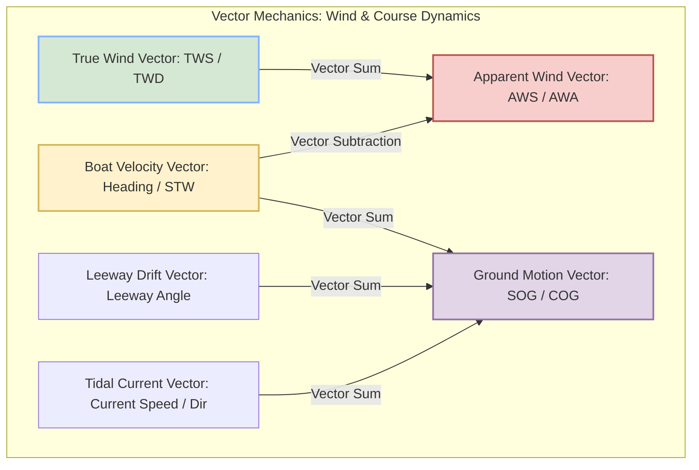
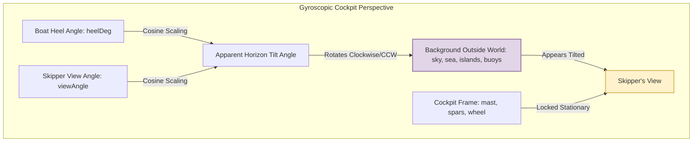

# Seamanship & Yacht VPP Physics Model Specification

This document provides a detailed technical specification of the deterministic world, physics, and 2.5D camera projection engines running in the Skippie sailing simulator.

---

## 1. Core Physics Philosophy: 3-DOF Equilibrium VPP
Rather than implementing a dynamic, high-frequency 6-DOF rigid body physics solver (which introduces complex numerical integrations, step-size dependencies, and oscillations), Skippie implements a **modular, deterministic 3-Degree of Freedom (3-DOF) steady-state Velocity Prediction Program (VPP)**.

The physics engine computes the boat's equilibrium state based on wind strength, wind angle, engine settings, and sail trims, and smooths transitions using analytical solutions.

### A. Yacht Profile: Beneteau First 36.7
The VPP model is calibrated around the operational characteristics of a standard **Beneteau First 36.7**:
* **Length Overall (LOA):** $10.64\text{ m}$
* **Displacement:** $5,915\text{ kg}$
* **Maximum Engine RPM:** $3,000\text{ RPM}$
* **Maximum Engine Speed:** $7.5\text{ knots}$
* **Reference Wind Speed (Polar):** $12.0\text{ knots}$
* **Golden Polar Performance Vectors:**
  * Apparent Wind Angles (TWA): $[0^\circ, 35^\circ, 45^\circ, 60^\circ, 90^\circ, 120^\circ, 150^\circ, 180^\circ]$
  * Target Speeds (STW, kts): $[0.0, 5.2, 6.7, 7.2, 7.5, 7.3, 6.1, 4.8]$
  * Target Heels (Heel, deg): $[0.0, 14.0, 22.0, 24.0, 20.0, 15.0, 8.0, 2.0]$

---

## 2. Mathematical Formulations

### A. Polar Interpolation & Wind Scaling
For any given True Wind Angle ($TWA$) and True Wind Speed ($TWS$), the base steady-state targets are interpolated linearly between our polar reference vectors and scaled relative to our polar wind reference ($12.0\text{ kts}$):

$$\text{stw}_{\text{polar}} = \text{Interpolate}(|TWA|, \vec{\text{polarTWA}}, \vec{\text{polarSTW}})$$
$$\text{heel}_{\text{polar}} = \text{Interpolate}(|TWA|, \vec{\text{polarTWA}}, \vec{\text{polarHeel}})$$

Since lift scales quadratically with wind speed and drag scales linearly:
$$\text{stw}_{\text{base}} = \text{stw}_{\text{polar}} \times \left( \frac{TWS}{TWS_{\text{ref}}} \right)$$
$$\text{heel}_{\text{base}} = \text{heel}_{\text{polar}} \times \left( \frac{TWS}{TWS_{\text{ref}}} \right)^2$$

### B. Sail Efficiency & Trim Constraints
Sail efficiency ($\eta$) is modelled dynamically based on the deviation of main/genoa sheets from optimal trims relative to the wind:
$$\eta = \exp\left( -\frac{(\text{trim} - 0.5)^2}{0.05} \right)$$
An **irons luffing penalty** is applied if the true wind angle is too tight to the bow:
$$\text{If } |TWA| < 25^\circ \implies \eta \leftarrow \eta \times \left( \frac{|TWA|}{25.0} \right)$$

Combined sail efficiency is the average of active sails:
$$\eta_{\text{total}} = \frac{\eta_{\text{main}} \times \mathbb{I}_{\text{main\_raised}} + \eta_{\text{genoa}} \times \mathbb{I}_{\text{genoa\_raised}}}{2.0}$$

### C. Engine Thrust & Vector Combining
Engine speed through the water ($STW_{\text{engine}}$) scales linearly with RPM. Total resulting target speed is the root sum of squares of sail and engine forces:
$$STW_{\text{target}} = \sqrt{ (STW_{\text{base}} \times \eta_{\text{total}})^2 + STW_{\text{engine}}^2 }$$
$$\text{heel}_{\text{target}} = \text{heel}_{\text{base}} \times \eta_{\text{total}}$$

### D. Leeway Calculation
Leeway drift angle ($\lambda$) represents the aerodynamic side-force slip, scaling higher with heel and lower with forward speed:
$$\lambda = 4.0 \times \left( \frac{\text{heel}_{\text{target}}}{25^\circ} \right) \times \left( \frac{\max(1.0, STW_{\text{base}})}{\max(0.5, STW_{\text{target}})} \right)$$

---

## 3. Dynamic Smoothing: First-Order Lag Filters
To eliminate numerical instabilities, oscillations, or overshoot anomalies during sudden maneuvers (such as tacking or dumping sheets), the actual states are smoothed toward steady-state targets using stable, analytical solutions to first-order lag filters over the tick interval ($\Delta t$):

$$\text{speed}(t + \Delta t) = STW_{\text{target}} + (\text{speed}(t) - STW_{\text{target}}) \times e^{-k_{\text{stw}} \Delta t}$$
$$\text{heel}(t + \Delta t) = \text{heel}_{\text{target, signed}} + (\text{heel}(t) - \text{heel}_{\text{target, signed}}) \times e^{-k_{\text{heel}} \Delta t}$$
$$\text{leeway}(t + \Delta t) = \lambda_{\text{signed}} + (\text{leeway}(t) - \lambda_{\text{signed}}) \times e^{-k_{\text{leeway}} \Delta t}$$

* **Filter Rates:** Speed Inertia $k_{\text{stw}} = 0.5\text{ s}^{-1}$, Heel Stiffness $k_{\text{heel}} = 2.0\text{ s}^{-1}$, Leeway $k_{\text{leeway}} = 1.0\text{ s}^{-1}$.
* **Leeward Heeling Signs:** Yacht always heels leeward (away from the wind):
  $$\text{twa} \ge 0 \implies \text{heel}_{\text{target, signed}} = -\text{heel}_{\text{target}} \quad (\text{Port heel under Starboard wind})$$
  $$\text{twa} < 0 \implies \text{heel}_{\text{target, signed}} = +\text{heel}_{\text{target}} \quad (\text{Starboard heel under Port wind})$$

---

## 4. Apparent Wind & Ground Track Geometry
Apparent wind vectors (representing what instruments measure) and SOG/COG vectors are computed by subtracting boat motion from true environmental vectors:



1. **Apparent Wind Velocity Vector:**
   $$\vec{V}_{\text{apparent}} = \vec{V}_{\text{wind, true}} - \vec{V}_{\text{boat, stw}}$$
   $$AWS = \|\vec{V}_{\text{apparent}}\|, \quad AWA = \angle(\vec{V}_{\text{apparent}}) - \text{heading}$$
2. **Ground Motion Vector (SOG/COG):**
   $$\vec{V}_{\text{sog}} = \vec{V}_{\text{boat, stw}} + \vec{V}_{\text{leeway}} + \vec{V}_{\text{tide}}$$

---

## 5. Visual 2.5D Camera Projection Engine

Skippie maps the 2D tactical coordinate space directly to a rich, perspective cockpit lookout view inside a shared `src/sim/projection.ts` module.

```mermaid
graph LR
    subgraph 2D Tactical Arena (World coordinates)
        E[Entity Position: X, Y]
        B[Boat Position: X, Y]
        VH[View Heading: deg]
    end

    subgraph Relative Calculations
        E & B --> D[Relative Distance: d]
        E & B & VH --> RB[Relative Bearing: φ_rel]
    end

    subgraph 2.5D Viewport Mapping
        RB -->|Normalised / 32 deg| SX[Screen X: 350 + φ_rel/32 * 310]
        D -->|Asymptotic Scale| SY[Screen Y: 200 + 1-exp -22/d * 80]
        D -->|Quadratic Decay| SC[Scale: 18/d ^ 1.3]
    end

    subgraph Viewport Rendering
        SX & SY & SC -->|Visible?| Render[Render Element on Canvas]
        RB -->|If > 32 deg| Clip[Clipped/Invisible]
    end

    style Render fill:#d5e8d4,stroke:#82b156,stroke-width:2px
    style Clip fill:#f8cecc,stroke:#b85450,stroke-width:2px
```

### A. Relative Bearings & Field of View (FOV)
Our visual field of view is centered at $350\text{px}$ (dead center of a $700\text{px}$ canvas) and spans a $64^\circ$ visual cone ($+/- 32^\circ$ relative bearing):
* **Relative Bearing ($\phi_{\text{rel}}$):**
  $$\phi_{\text{rel}} = \text{NormalizeDegrees}(\text{BearingToEntity} - \text{ViewHeading})$$
* **Horizontal Positioning ($screenX$):**
  $$screenX = 350 + \left( \frac{\phi_{\text{rel}}}{32^\circ} \right) \times 310\text{px}$$
* **FOV Clipping:** If $|\phi_{\text{rel}}| > 32^\circ$, the entity is flagged `visible = false` and clipped.

### B. Vertical Depth & Scaling Geometry
To represent 3D depth asymptotically on a flat 2D plane:
* **Vertical Positioning ($screenY$):** Near objects appear lower, far objects compress asymptotically near the horizon line ($200\text{px}$):
  $$screenY = 200 + \left( 1.0 - e^{-22.0 / d} \right) \times 80\text{px}$$
* **Geometric Scale:** Scale shrinks quadratically relative to distance $d$ to mimic linear visual decay:
  $$\text{scale} = \min\left( 3.5, \, \left( \frac{18.0}{d} \right)^{1.3} \right)$$

### C. Apparent Horizon Tilt Perspective
When standing at the helm pedestal on a heeled yacht, your inner ear keeps your head aligned vertically with the boat. The apparent tilt of the horizon relative to the cockpit changes based on your looking vector:



* Looking straight forward ($0^\circ$), you see the **full transverse tilt**.
* Looking directly to the side ($90^\circ$), you look along the heel axis of rotation, so the **horizon appears level**.
* In general, the visible horizon tilt scales with the **cosine** of the look angle:
  $$\theta_{\text{apparent}} = -\theta_{\text{heel}} \times \cos(\text{viewAngle})$$
* Background scenery (clouds, islands, buoys, and other ships) is rotated by $\theta_{\text{apparent}}$ while the rigging and cockpit stay upright on screen, mimicking looking out of a heeling vessel.
